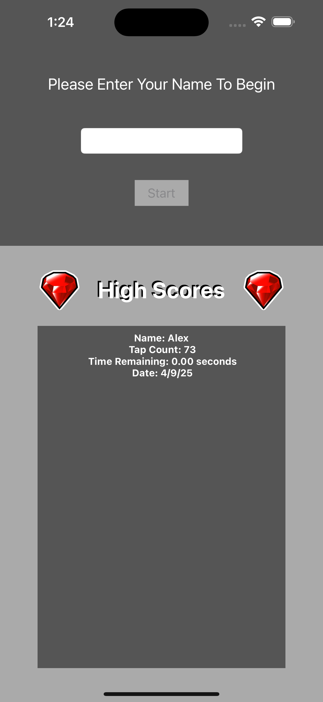
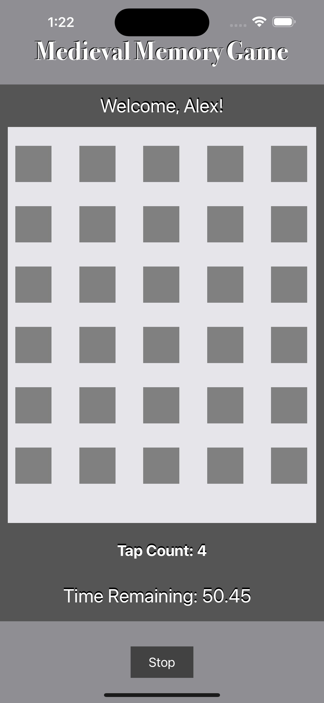

# MemoryMatchGame-iOS

An iOS memory matching game built using Swift and UIKit, featuring adaptive layouts for iPhone and iPad with dynamic grid sizes based on the device. The game includes a countdown timer, animated tile previews, and responsive UI interactions. Upon completion, user performance data is saved using Core Data and displayed in a high scores view.

---

## Features

- Adaptive grid layouts for iPhone and iPad using size classes
- Animated tile flip previews
- Countdown timer for added difficulty
- Responsive UI and replayable game logic
- High score tracking with Core Data persistence
- Dedicated high scores view with stored session history
- Supports portrait and landscape orientations

---

## Technologies Used

- Swift 5
- UIKit
- Core Data (for persistent local storage)
- Auto Layout with size class adaptation (iPhone/iPad responsiveness)
- UIView animations and transitions
- Timer and game state management
- Interface Builder with storyboard-based UI

---

## Screenshots

### Start Screen

### Game Board

### High Scores

---

## Getting Started

1. Clone the repo or download the ZIP  
2. Open `MemoryMatchGame.xcodeproj` in Xcode  
3. Build and run on a simulator or device  
4. Match tiles, beat the timer, and try to top your high score

---

## Author

Alex Eyer
Created at Full Sail University for iOS coursework  
